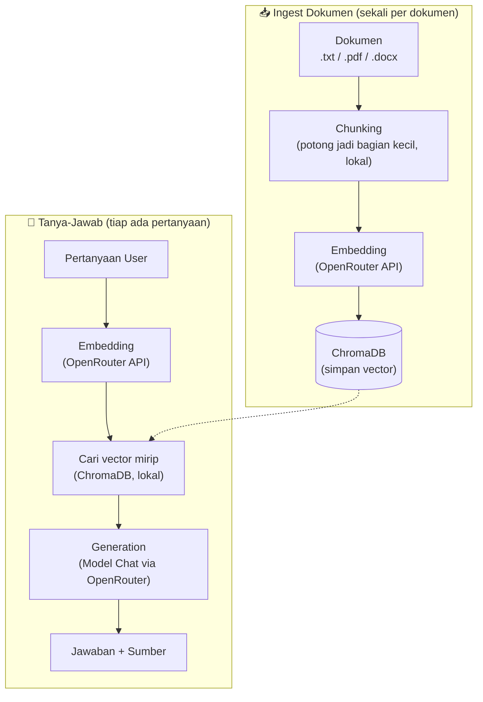

# mini-rag-openrouter

[](https://pypi.org/project/mini-rag-openrouter/)
[](https://pypi.org/project/mini-rag-openrouter/)
[](LICENSE)

RAG (Retrieval-Augmented Generation) pipeline sederhana menggunakan [OpenRouter](https://openrouter.ai) sebagai gateway model embedding & chat, dan [ChromaDB](https://www.trychroma.com) sebagai vector database lokal.

## Fitur

- Ingest dokumen `.txt`, `.pdf`, `.docx` dari satu folder sekaligus
- Deteksi dokumen yang sudah pernah di-ingest (skip otomatis, hemat API call)
- Vector search lokal via ChromaDB, tidak perlu server tambahan
- Model embedding & chat bisa dikustomisasi lewat parameter
- Tersedia contoh integrasi REST API (FastAPI)

## Instalasi

```bash
pip install mini-rag-openrouter
```

Untuk contoh REST API (FastAPI), install dengan extra `api`:

```bash
pip install "mini-rag-openrouter[api]"
```

## Alur Kerja

Ada dua alur utama: **ingest dokumen** (dilakukan sekali per dokumen) dan **tanya-jawab** (dilakukan tiap ada pertanyaan). Keduanya berbagi vector database ChromaDB yang sama.



Penjelasan tiap tahap:

| Tahap | Dikerjakan oleh | Butuh API? |
|---|---|---|
| Chunking | Kode Python lokal | Tidak |
| Embedding | Model embedding via OpenRouter | Ya |
| Simpan & cari vector | ChromaDB (lokal, di disk) | Tidak |
| Generation | Model chat via OpenRouter | Ya |

## Pemakaian Cepat

```python
from mini_rag import RAGPipeline

rag = RAGPipeline(
    api_key="sk-or-xxxxxxxx",   # API key dari openrouter.ai
    chroma_path="./chroma_db",  # lokasi penyimpanan vector database
)

# Ingest dokumen dari folder (mendukung .txt, .pdf, .docx)
rag.ingest_folder("./dokumen")

# Tanya
result = rag.query("Apa itu ChromaDB?")
print(result["answer"])
print(result["sources"])
```

## Kustomisasi Model

```python
rag = RAGPipeline(
    api_key="sk-or-xxxxxxxx",
    embed_model="openai/text-embedding-3-small",
    chat_model="minimax/minimax-m3:free",
)
```

> **Catatan:** semua dokumen dalam satu `chroma_path` harus pakai `embed_model` yang sama sejak awal. Mengganti model embedding di tengah jalan akan membuat vector lama tidak bisa dibandingkan dengan vector baru.

## Struktur Project

```
src/mini_rag/
├── __init__.py         # entry point (RAGPipeline)
├── pipeline.py          # class RAGPipeline — orkestrasi semua langkah
├── chunking.py           # potong dokumen jadi chunk kecil
├── embeddings.py          # panggil endpoint /embeddings OpenRouter
├── vector_store.py         # wrapper ChromaDB (simpan & cari vector)
├── generation.py            # panggil endpoint /chat/completions OpenRouter
└── document_loader.py        # baca .txt / .pdf / .docx
```

## Contoh REST API

Lihat [`examples/app.py`](examples/app.py) untuk contoh integrasi ke FastAPI (endpoint `/ingest` dan `/query`).

```bash
cd examples
cp .env.example .env   # isi OPENROUTER_API_KEY
uvicorn app:app --reload
```

Endpoint yang tersedia:

| Method | Path | Fungsi |
|---|---|---|
| `GET` | `/health` | Cek server hidup |
| `POST` | `/ingest` | Upload dokumen |
| `POST` | `/query` | Tanya, dapat jawaban + sumber |

## Lisensi

MIT